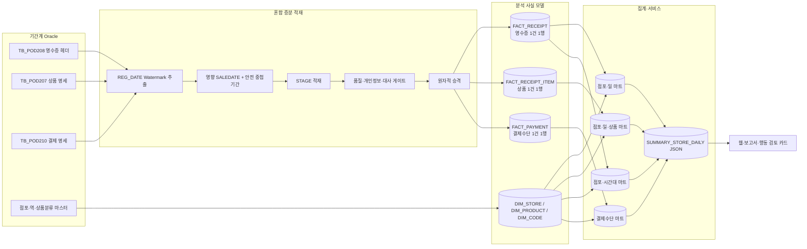

# AI 기반 POS 매출 분석·가이드 플랫폼 설계서

**코레일유통 — AI 챔피언 블랙 개인프로젝트**

| 문서 정보 | 내용 |
|---|---|
| 문서명 | AI 기반 POS 매출 분석·가이드 플랫폼 설계서 |
| 버전 | v1.2 (v1.1 + 정합성 수정 A~G 반영: 적재방식 통일, 원 운영요구 재확인, 반응형 복원, 이관 전환규칙, 입력 정제, 과도기 RACI) |
| 작성일 | 2026-07-21 (v1.2 동일자 개정) |
| 작성 | IT 담당 한재진 |
| 용도 | ① AI 챔피언 블랙 개인프로젝트 심사 ② 사내 구축 기초 문서 ③ 타 공공기관 확산 참조 |

> 본 설계서는 실제 테이블 메타정보와 2025년 연간 데이터 건수를 반영했다. 다만 업무 규칙·배치 성능·보안 승인처럼 아직 증빙이 연결되지 않은 사항은 확정 사실로 쓰지 않는다. 측정 없는 수치는 주장하지 않으며, 주요 판단에는 아래 근거 상태를 표시한다.

| 근거 상태 | 의미 | 사용 예시 |
|---|---|---|
| `[실측]` | 쿼리·로그·파일로 확인한 값 | 2025년 테이블별 건수 |
| `[확인완료]` | 담당부서 회신 또는 공식 문서로 확인 | 거래코드 정의, 보안 승인 |
| `[목표]` | 달성해야 할 서비스 수준 | 첫 화면 3초 |
| `[추정]` | 계산이나 경험치를 이용한 예상 | 저장용량, 이관기간 |
| `[가정]` | 업무 담당 확인 전 임시 규칙 | 정상거래 코드 |
| `[검증 예정]` | 파일럿·성능시험에서 확인할 항목 | 01~06시 배치 완료 가능성 |

---

## 목차

1. 추진 배경 — AI 거점 리더의 6가지 질문
2. 과제 정당성 — 대표 과제 선정 7대 기준 자가진단
3. 업무 재설계 — AI 네이티브 6단계 To-Be
4. 요구사항 정의
5. 데이터 아키텍처 설계
6. AI 분석 레이어 설계
7. 웹 구현체 및 화면 설계
8. 재사용 프레임워크 설계 (타 공공기관 확산)
9. KPI 및 체감효과 정의
10. 보안·규정 준수 및 운영 책임체계
11. 실행 로드맵·위험·테스트·근거관리
12. 최종 검수 — 리트머스 테스트·ADR·요약
- 부록 A. 인사이트 대장 (31건)
- 부록 B. 용어집
- 부록 C. 거래 코드·대사 규칙 질의서
- 부록 D. 어댑터 규격 서식
- 부록 E. 원천 데이터 실측 요약
- 부록 F. 데이터 계약서 초안
- 부록 G. 근거 기록(Evidence Record) 대장

---

# 1. 추진 배경 — AI 거점 리더의 6가지 질문

## 1.1 문제 (Problem)

전국 970여 개 점포 중 1차 대상인 직영 유인 매장의 점포장은 매일 기간계 화면에서 전일 매출을 조회하고, 일·주·월 보고서를 엑셀로 다시 만든다. 영수증 분석 결과를 만들려면 POS 영수증 헤더·품목·결제 데이터에 점포·역·상품분류 마스터를 연결해야 하므로, 사용자가 업무시간에 원천 테이블을 반복 조회하면 응답이 느려지고 기간계에 분석 부하를 줄 수 있다. 정확한 현재 조회시간과 보고서 작성시간은 `[실측 예정]`이다.

2025년에는 `TB_POD208` 영수증 헤더 86,762,567건, `TB_POD207` 상품 명세 124,905,606건, `TB_POD210` 결제 명세 85,044,474건이 발생했다 `[실측]`. 세 테이블의 물리적 행 수 합계는 **296,712,647행**이지만, 이는 영수증 수가 아니라 서로 다른 데이터 단위의 합계다. 같은 영수증을 점포→권역→본사가 각자 다시 집계하면 조직이 동일한 숫자를 여러 번 만드는 구조가 된다.

현장의 진짜 불편은 데이터가 없다는 것이 아니다. 점포장은 이미 쌓인 데이터를 필요한 시점에 빠르게 이해하지 못하고, 표를 만드는 데 시간을 써서 발주·진열·고객 대응 판단이 늦어진다. 직영이 아닌 개인 사업자 매장도 회사 POS에 자기 매출이 쌓이지만 분석 도구·인력·시간이 부족하므로, 확산 단계에서는 별도의 접근권한·보안·제공정책을 거쳐 자기 매장 데이터 기반 경영지원을 받을 수 있게 한다.

## 1.2 성과 (Outcome)

본 플랫폼의 목적은 두 겹이다.

- **직영 매장 — 업무 생산성**: 점포장이 반복하던 조회와 보고서 초안 작성을 시스템이 대신하고, 점포장은 자동 생성 결과를 확인한 뒤 발주·진열·인력배치 판단에 집중한다.
- **개인 사업자 매장 — 사회적 가치**: 외부 사용자 접근정책과 보안 심의를 통과한 뒤, 분석 인력이 부족한 소상공인에게 자기 매장 데이터 기반 경영 리포트를 제공한다.

점포장 요구 우선순위는 현재 `① 쉬운 조회 ② 발주 검토 신호 ③ 상품·시간대 파악 ④ 보고 부담 감소`로 설계에 반영하되, 인터뷰 인원·일자·질문지가 연결되기 전까지 `[검증 예정]`으로 관리한다.

**“AI 없이도 풀 수 있는 문제 아닌가?”에 대한 답**: 조회 개선·데이터 적재·집계·차트·보고서 자동생성은 AI 없이 해결한다. 로컬 LLM의 추가 가치는 수백 개 점포에서 서로 다르게 나타나는 계산 결과를 고연령 사용자도 이해하기 쉬운 문장으로 바꾸고, 코드가 선택한 행동 유형을 점포 상황에 맞게 설명하는 데 있다. LLM을 사용할 수 없는 날에도 템플릿 엔진으로 서비스가 완결되므로, 이 과제는 “AI가 없으면 멈추는 시스템”이 아니라 “AI가 설명 품질을 높이는 시스템”으로 설계한다.

## 1.3 업무 (Work)

- **자동화**: 일·주·월 집계, 증감 계산, 차트·리포트 초안 — 코드가 대신한다.
- **제거**: 점포장의 엑셀 보고서 작성과 권역·본사의 수작업 취합 — 사전 집계 마트가 존재 자체를 없앤다.
- **사람의 판단**: 발주 최종 결정(기존 발주 시스템에서 점포장이 직접 실행), 인력 배치, 프로모션 — AI는 제안 문구까지만 담당하며 발주 시스템 자동 연동은 범위에서 제외한다. 내비게이션은 경로를 제안할 뿐, 핸들은 점포장이 잡는다.

## 1.4 데이터 (Data)

기간계 Oracle의 실체는 영수증 3종과 마스터 5종으로 확인되었다. 2025년 연간 건수는 헤더 86,762,567건, 품목 124,905,606건, 결제 85,044,474건이다 `[실측]`. 공통 영수증 식별키는 `DEPT_CD + SALEDATE + POSNO + DEALNO`이며, 품목과 결제에는 각각 순번이 추가된다.

세 거래 테이블에는 `REG_DATE`가 있고, 헤더에는 `ITEMCNT`, `TENDERCNT`, 원거래 참조키와 `CANCELTYPE`이 존재한다 `[실측]`. 따라서 저장일시 기반 증분 추출, 영향받은 판매일자 재생성, 명세·결제 건수 대사가 가능하다. 날짜 파티션 실행계획, 야간 배치 계정 승인, 정상거래·취소·반품 코드 정의는 증빙이 연결되기 전까지 각각 `[검증 예정]` 또는 `[확인 필요]`로 관리한다.

품질 위험은 ① 비판매 거래 혼입 ② 취소·반품 상계 ③ 명세·결제 다대다 조인으로 인한 매출 중복 ④ 분류 미등록 상품의 누락 ⑤ 지연 도착·정정 거래다. 개인정보는 카드번호·회원번호·전화번호·사업자번호·대표자명·상세주소 등 분석에 필요 없는 컬럼을 추출 SQL 화이트리스트에서 제외한다. 폐기·현재고·입고예정·결품 데이터는 현재 분석 원천에 없으므로 구체적인 발주량 자동결정과 폐기·결품 개선 수치는 주장하지 않는다.

## 1.5 사람 (People)

1차 사용자는 직영 점포장, 권역 관리자, 본사 담당자, 경영진이다. 개인 사업자·위탁 점주는 외부 사용자 접근, 데이터 제공 범위, 약관, 인증수단을 별도로 설계한 뒤 확산 단계에서 포함한다.

- **고연령 점포장의 “또 새 시스템” 피로** → 글자 18px 이상, 버튼 48px 이상, 첫 화면 0터치 스크롤, 쉬운 말과 행동 카드 0~3개.
- **관리자의 분석 숫자 불신** → 숫자뿐 아니라 대상·기간·방향·단위·근거키를 구조적으로 대조하고, 검증 실패 문장은 표시하지 않고 템플릿으로 대체한다.
- **감시 도구로 오해할 위험** → 미접속과 기각 로그는 지원·개선 목적으로만 사용하고 인사평가에 사용하지 않는다는 운영정책을 파일럿 안내문에 명시한다.

사용 기기는 매장 PC의 사내망을 기준으로 시작한다. “틀린 숫자가 절대 나올 수 없다”는 과도한 표현 대신, **오류 가능성을 품질 게이트와 주장 검증기로 구조적으로 차단하고 실패 시 마지막 성공 데이터 또는 검증된 템플릿만 보여준다**고 정의한다.

## 1.6 실행 (Execution)

심사(9월 초)가 파일럿 결과까지 요구하므로 이중 로드맵으로 실행한다.

- **심사 트랙(6주 역산)**: 1~2주차 설계서 완성 + 파일럿 섭외 착수(섭외 권한 확인이 최우선) + Baseline 실측 → 2~4주차 최소 프로토타입 → 4~6주차 점포 1~3곳 미니 파일럿 → 9월 초 결과 포함 제출. 섭외 불발 시 Plan B로 실데이터 기반 1개 점포 시뮬레이션 검증을 수행한다.
- **정식 트랙**: 심사 후 파일럿 5~10곳 4~8주(대형 역사점·중소형점·고연령 점포장 포함 선정) → Go/No-Go 통과 시 권역 → 직영 전 점포 → 소상공인·타 기관 확산. 파일럿 중 기존 보고 체계를 병행 유지해 되돌릴 수 있게 한다.

---

# 2. 과제 정당성 — 7대 기준 자가진단

자가진단은 확인된 근거와 아직 확인할 사항을 분리한다. 전 항목을 ‘상’으로 매기기보다, 파일럿에서 검증해야 하는 항목은 ‘중’으로 두고 보완 과업과 연결한다.

| # | 기준 | 충족 근거 | 점수 |
|---|---|---|:---:|
| 1 | 핵심 임무 직결 | 코레일유통의 역사 유통 매출 데이터를 직접 다루고, 기존 본사 집계에서 현장 점포장의 운영판단으로 사용 범위를 확장한다. | 상 |
| 2 | 현장 체감 | 느린 조회와 반복 보고·재취합이라는 업무 장면이 명확하다. 다만 점포장 인용문과 실제 소요시간은 1~2주차 인터뷰·실측으로 증빙한다. | 중 |
| 3 | 반복성 | 일·주·월 보고와 매일 매출 확인이 반복되며, 같은 원천을 기간만 달리 집계한다. | 상 |
| 4 | 다부서 사용 | 점포장·권역·본사 영업·상품·경영진이 동일 마트를 권한별 화면으로 사용한다. | 상 |
| 5 | 데이터 확보 | 테이블 메타·샘플·조인키·2025년 건수는 확보했다. 다만 거래코드 공식 정의, 실행계획, 야간 계정 승인 증빙은 연결 전이므로 중으로 평가한다. | 중 |
| 6 | 성과 측정 | 시간절감 산식과 기술 KPI는 정의했으나 Baseline·After가 아직 없다. 폐기·결품 데이터도 부재한다. | 중 |
| 7 | 확산 가능성 | 엔진/어댑터 분리와 민원·예산·자판기 사례를 설계했으나 실제 두 번째 어댑터 구현 전이다. | 중 |

**‘중’ 항목 보완 계획**

- 기준 2: 대·중·소형 점포 각 1곳 이상을 인터뷰하고, 질문지·일자·인원·인용문을 `EV-USER-*` 근거기록으로 남긴다.
- 기준 5: 거래코드 회신, 파티션 실행계획, 배치계정 승인문서를 `EV-DATA-*`로 연결한다. 확인 전에는 `[가정]` 또는 `[검증 예정]` 표기를 유지한다.
- 기준 6: 조회·보고·취합 Baseline을 측정하고, 자동생성 후에도 남는 확인시간을 After로 측정한다. “작성 0분”이 아니라 “수작업 작성 X분→결과 확인 Y분”으로 증명한다.
- 기준 7: 민원 또는 자판기 샘플 어댑터를 실제 설정파일로 구현하고 작성시간·막힌 지점을 기록한다.

**기존 시스템과의 관계**: 기존 경영정보 시스템의 전사 재무·정산 집계를 대체하지 않는다. 본 과제는 ① 현장 사용자 확대 ② 영수증·상품 수준 분석 ③ 쉬운 설명과 행동 검토 신호 제공을 담당한다. 분석 숫자는 운영 참고용이며 정산·회계 원천은 기간계다.

# 3. 업무 재설계 — AI 네이티브 6단계 To-Be

기존 업무에 AI를 얹는 것이 아니라 업무 구조 자체를 다시 그린다. 마차에 엔진을 다는 것이 아니라 자동차를 설계하는 것이다.

## 3.1 As-Is — 같은 숫자를 조직이 세 번 만드는 구조

- [매일] 점포장: 기간계 접속 → 느린 조회 대기 → 어제 매출 확인 → 엑셀 일일 실적 작성 → 제각각의 채널(이메일·게시판·메신저)로 전송
- [주·월 반복] 점포장: 주간 정리 + 월 마감 보고 추가 작성
- [취합 계단] 권역 담당: 채널을 오가며 수합 → 누락 독촉 → 단순 합산·정리 → 본사 전송 / 본사 담당: 재취합 → 눈검증 → 경영 보고 작성

구조적 낭비: ① 계단식 재가공(점포→권역→본사 3회) ② 채널·양식 파편화 ③ 검증의 수작업 ④ 행동 공백 — 산출물은 "지난 숫자"일 뿐 "오늘 할 일"은 아무도 알려주지 않음.

## 3.2 To-Be — AI 네이티브 6단계

**1단계. 데이터 자동 호출**: 00시 마감 → 01시 `REG_DATE` Watermark 증분 + 영향 판매일자·안전 중첩기간 재생성 적재(5장, 중첩 기본 7일) → 품질 게이트 → 마트 갱신 → 점포별 요약·행동 카드 사전 생성 → 06시 이전 완료. 점포장이 기다리던 조회가, 이미 계산된 화면을 여는 일로 바뀐다. [점포장 조회 실측 X분 → 3초] [남는 일: 없음]

**2단계. 시스템 사전 품질 점검**: 품질 게이트 7단계(개인정보 차단·비판매 제외·취소 상계·중복·정합 대조·미분류 보정·이상치)가 취합 검증을 대신한다. [취합 검증 실측 Y시간/주 → 게이트 리포트 확인 5분] [남는 일: 이상 플래그 확인]

**3단계. 시스템 보고서 초안 완성 + AI 설명**: 통계 계층이 계산하고 LLM이 계산 결과만 인용해 쉬운 말 설명과 행동 카드를 생성한다. 일·주·월 3종이 같은 마트에서 자동 생성된다. 원칙: **보고서는 전송되지 않는다 — 접속하면 이미 있다.** (전환기: 자동 생성 엑셀 다운로드로 기존 채널 보고 대체 가능) [보고서 수작업 작성 실측 X·Y·Z분 → 자동생성 결과 확인 `[목표 3~5분, 파일럿 실측으로 확정]`] [남는 일: 예외 확인과 최종 판단]

**4단계. 점포장은 판단만**: 원하는 시점에 하루 5분(아침 동선이 점포마다 다름을 반영한 시점 중립 설계) — 요약 확인 → 카드 0~3개 검토 → 가능한 해석과 발주·진열 **검토 신호** 확인(구체 발주수량은 제시하지 않으며, 발주는 재고·입고예정을 확인해 기존 시스템에서 직접 결정) / 기각 시 사유 3택. 카드는 "지금부터 하면 좋은 일" 프레임이며 지난 시간대 제안은 자동 숨김. [남는 일: 판단과 실행 — 점포장 본연의 일]

**5단계. 권역·본사는 방향과 예외만**: 단순 합산 업무 소멸 → 예외 점포(급락·급증) 지원과 코칭으로 전환. 순위·실명 비교는 권역·본사 권한 전용. 미접속 신호는 지원 목적으로만 사용하며 평가에 활용하지 않는다(파일럿 안내문 명문화). [취합 실측 → 예외 검토 일 10~20분] [남는 일: 예외 대응·전략·코칭]

**6단계. 피드백 재학습**: 채택/기각(+사유) 로그 자동 수집. "이미 함" 기각은 가이드가 정확했다는 신호로 분리 해석. 파일럿=IT 담당 주 단위 조정(변경 이력 첫날부터 기록), 정식=영업+IT 협의체 월 1회 — "실험은 빠르게, 운영은 책임 있게." [남는 일: 규칙 개선 승인]

## 3.3 최대 위험 공식 지정 — "점포장이 실제로 볼 것인가"

작성자 스스로 가장 자신 없는 지점으로 4단계를 지목하여 위험 표 1번으로 공식 승격한다. 원인 3분해와 대응:

| 원인 | 대응 |
|------|------|
| 습관 부재 (지금도 확인 포기 점포장 존재) | 보고 부담 제거를 실익으로 — "이 화면을 열면 일일 보고가 끝나 있다"를 첫 화면에서 즉시 체감(엑셀 다운로드). 습관은 효용이 아니라 기존 의무의 대체에서 생긴다 |
| 효용 불신 (뻔한 가이드면 2주 내 이탈) | 행동 카드 0~3개 가변 — 침묵할 줄 아는 AI + 파일럿 주 단위 규칙 조정 |
| 감시 오해 ("회사가 나를 보는 도구") | 미접속 신호 지원 목적 한정·평가 미활용 명문화 + 형식 접속 검출 지표(접속 후 3초 내 이탈 비율) 병행 관찰 |


## 3.4 자동 보고가 실제 업무 제거로 이어지는 전환 조건

보고서가 자동으로 만들어져도 권역과 본사가 기존 엑셀 제출을 계속 요구하면 점포장은 이중 업무를 하게 된다. 다음 조건을 순서대로 충족해야 “보고 자동화”가 “보고 업무 제거”로 전환된다.

1. 권역·본사가 사용할 표준 보고서와 지표 산식을 승인한다.
2. 자동 보고서와 기간계 확정값의 대사 기준을 합의한다.
3. 전환기간에는 기존 보고와 자동 보고를 병행해 차이를 기록한다.
4. 승인권자가 기존 제출 채널의 종료일을 확정한다.
5. 종료 이후에는 예외 사유 확인만 남기고 동일 숫자 재작성 의무를 폐지한다.

---

# 4. 요구사항 정의

## 4.1 기능 요구사항

### FR-1 점포장

- **FR-1.1 오늘의 요약**: 점포장이 기간계에서 반복 조회하던 일을 새벽에 미리 계산된 화면이 대신한다. 1층은 총매출·증감·기준일, 2층은 손님 수와 1인당 구매액·시간대, 3층은 TOP 5로 구성한다.
- **FR-1.2 행동 검토 카드**: 점포장이 감으로 찾던 이상 신호를 코드가 0~3개 선택하고, AI 또는 템플릿이 `[현상→가능한 해석→확인·권장 행동→기대되는 점/확인할 점→근거]`으로 설명한다. 재고·입고예정·폐기 데이터가 없으므로 구체 발주수량은 제시하지 않는다. `TB_SMM102.ORDER_POSBL_YN='Y'`인 점포에만 발주 검토 카드를 노출한다.
- **FR-1.3 보고 대체**: 일·주·월 표준 보고서를 자동 생성하되, 권역·본사 승인과 기존 제출 채널 종료 전까지는 전환기간으로 운영한다. 화면과 보고서는 같은 마트의 같은 숫자를 사용한다.
- **FR-1.4 상세 차트**: 추이·시간대·분류·TOP 차트를 제공한다. 파일럿은 매출 규모 3분위 비교군으로 시작하고, 확산 단계에는 매장구분·면적·KTX 여부·영업시간·운영유형을 결합한 유사 점포 비교로 개선한다. 비교군은 N≥10일 때만 표시한다.

### FR-2 권역 관리자

- **FR-2.1 취합의 소멸**: 점포별 보고를 다시 합산하던 일을 권역 대시보드가 대신한다.
- **FR-2.2 예외 탐지**: 급락·급증·미수신·품질 게이트 이상이 있는 점포만 우선 보여주고, 미접속은 지원 목적으로만 사용한다.

### FR-3 본사 담당 / FR-4 경영진

- **FR-3.1 전사 비교**: 전사→권역→점포 드릴다운과 상품분류 추이를 제공한다.
- **FR-3.2 상품 분석**: 상품·분류·시간대 반응을 분석하되, 정산·세무 수치로 사용하지 않는다.
- **FR-4.1 월간 1페이지**: 핵심 지표 4개, 가능한 해석 1개, 근거 상태를 한 화면에 표시한다.

### FR-5 시스템 공통

- **FR-5.1 피드백**: 채택·기각·사유·엔진모드·발동조건 스냅샷과 규칙 변경 이력을 저장한다.
- **FR-5.2 구조화된 주장 검증**: AI 문장의 숫자뿐 아니라 대상, 기간, 비교기준, 단위, 증감방향, 근거키를 계산 JSON과 대조한다. 검증 실패 시 문장을 폐기하고 템플릿으로 대체한다.
- **FR-5.3 권한**: 점포장은 자기 점포, 권역은 관할, 본사는 전사 범위만 조회한다. 점포코드는 인증수단이 아니라 데이터 필터다.
- **FR-5.4 배치 알림**: 실패·지연·미수신·대사오류를 운영자에게 알리고 마지막 성공 데이터는 계속 제공한다.
- **FR-5.5 수동 재처리**: 운영자가 기간을 지정하되 야간창·세션 1·스로틀·체크포인트·승인·작업이력을 적용한다.
- **FR-5.6 설명 엔진**: 파일럿 실제 구현은 로컬 LLM과 템플릿 모드다. 상용 API는 동일 입출력 인터페이스와 모의 Provider까지만 구현하고, 실제 호출은 보안 심의 후 확산 단계에서 활성화한다.
- **FR-5.7 데이터 계약 감시**: 원천 컬럼·코드·키·스키마가 계약과 달라지면 배치를 중단하고 변경 승인을 요청한다.

## 4.2 시니어 친화 UI 요구

UI-1 기본 글자 18px 이상·3단계 조절 / UI-2 버튼 48px 이상 / UI-3 핵심정보 2번 이하 터치·첫 화면 0터치 스크롤 / UI-4 쉬운 말 / UI-5 색+아이콘+문장 3중 표현 / UI-6 행동 카드 0~3개 / UI-7 키보드 탐색·명확한 포커스 / UI-8 고연령 사용자 과업성공률과 오류율을 파일럿에서 측정 / UI-9 화면은 반응형으로 구현한다 — 1차 기준은 매장 PC이되, 확산 단계 모바일 제공 시 재개발을 최소화한다(기기 혼합 사용 환경 확정사항).

## 4.3 비기능 요구사항

| 항목 | 파일럿 | 정식 |
|---|---|---|
| 신선도 SLA | D-1 확정 데이터 06시까지 `[목표]` | 동일, 필요 시 마이크로배치 별도 검토 |
| 응답 | 웜업 후 첫 화면 3초 이내 `[목표]` | 피크 동시접속 수용, 수치는 부하시험으로 확정 |
| 가용성 | 24시간 조회, 배치 중 마지막 성공 스냅샷 유지 | 동일 |
| 배치 | 혼합 증분+영향일자 재생성, 06시 완료 `[검증 예정]` | 완료율 99% 이상 `[목표]` |
| 복구 | RPO 1일, RTO 1영업일 이내 `[초안]` | 업무영향분석 후 확정 |
| 보안 | 사용자별 계정+서버 측 점포 권한표 | 사내 통합인증 연계 |
| 폐쇄망 | 로컬 모델·로컬 번들·CDN 0건 | 동일 |
| 하드웨어 | PC급+SSD 1TB `[추정]` | 파일럿 용량·CPU·동시접속 실측으로 산정 |

## 4.4 범위 제외

| 제외 항목 | 사유·처리 |
|---|---|
| 발주 시스템 자동연동·자동발주 | 사람의 최종 결정 원칙, 별도 심의 필요 |
| 구체 발주수량 자동추천 | 현재고·입고예정·최소주문단위·유통기한 데이터 부재 |
| 자판기·무인 매출 | 1차 제외, 데이터 적합성 검증 후 확산 1호 후보 |
| 외부 개인 모바일 접속 | 외부 인증·약관·보안정책 수립 후 검토 |
| 폐기·결품 정식 KPI | 원천 부재, 파일럿 수기 관찰만 수행 |
| 기존 경영정보·정산 시스템 대체 | 운영 분석 보완 서비스로 한정 |
| 회계·세무·정산 목적 | 정산 원천은 기간계 유일, 전 화면·보고서 고지 |
| 파일럿 상용 LLM 실호출 | 인터페이스만 구현, 보안 심의 후 활성화 |

# 5. 데이터 아키텍처 설계

비유: 기간계 Oracle은 거래를 처리하는 은행 창구다. 분석 서비스는 창구에서 매번 통계를 계산하지 않고, 필요한 장부 사본을 분석 저장소로 옮긴 뒤 데이터 단위를 보존한 사실 테이블과 미리 계산한 집계표를 사용한다.

## 5.1 전체 구조



**핵심 원칙**

1. 웹·보고서·AI 요청은 기간계에 직접 질의하지 않는다.
2. 영수증, 상품, 결제는 데이터 단위가 다르므로 하나의 평탄 테이블로 직접 조인해 합산하지 않는다.
3. 새 데이터를 완성된 STAGE에 적재·검증한 뒤 운영 테이블로 원자적으로 교체한다.
4. 사용자는 배치 실패 중에도 마지막 성공 데이터를 계속 본다.

## 5.2 적재 설계 — `REG_DATE` Watermark + 영향 판매일자 재생성

세 거래 테이블에는 `REG_DATE`가 존재한다 `[실측]`. 일일 배치는 저장일시 증분과 안전 중첩기간을 결합한다.

```text
1. REG_DATE > 직전 성공 Watermark 인 행 추출
2. 새 행이 영향을 주는 SALEDATE 목록 계산
3. 영향 SALEDATE + 최근 N일 안전 중첩기간을 STAGE에 재생성
4. 품질·건수·금액·개인정보 검증
5. 검증 성공 시 하나의 트랜잭션 또는 파일 스왑으로 승격
6. 성공 후에만 Watermark 갱신
```

| 실행 형태 | 파라미터 | 처리 |
|---|---|---|
| 일일 자동 | watermark + 안전 중첩 N일 | 지연 취소·정정 흡수. **N 기본값은 7일로 시작한다** — 당초 운영 요구(최근 7일 매일 재생성)를 STAGE 검증·원자적 승격 방식으로 그대로 이행하되 데이터 공백 위험만 제거한 것이다. 지연도착 분포 실측 후 N 축소를 검토한다 |
| 수동 재처리 | `--from --to` | 승인·야간창·스로틀·세션 1·체크포인트·작업이력 |
| 최초 이관 | 월 또는 일 단위 분할 | 파일럿 대상부터 적재, 날짜별 대사 후 다음 구간 진행. **이관→일일 배치 전환 규칙**: 이관 완료 검증 후 이관 데이터의 최대 `REG_DATE`를 초기 Watermark로 설정하고, 첫 일일 배치는 안전 중첩 7일을 포함해 시작한다 — 이관 기간 중 도착한 지연·정정분이 전환 경계에서 누락되지 않게 한다 |

**멱등성과 실패 안전성**: `DELETE→INSERT`를 사용자 노출 테이블에서 직접 수행하지 않는다. STAGE 또는 `analytics_next.duckdb`를 완성한 뒤 검증하고, 성공 시 운영 스키마/파일 포인터를 교체한다. 실패하면 `analytics_current`를 유지한다.

배치창 01~06시 완료, 7일 약 560만 건 처리 가능성, 최초 이관기간은 모두 `[검증 예정]`이다. 1일·7일·1개월 부하시험 결과를 Evidence로 남긴 뒤 확정한다.

## 5.3 사실 테이블과 데이터 단위

| 모델 | 원천 | 데이터 단위 | 기본키/고유키 | 주요 용도 |
|---|---|---|---|---|
| `FACT_RECEIPT` | TB_POD208 | 영수증 1건 | DEPT_CD+SALEDATE+POSNO+DEALNO | 점포 총매출·객수·객단가 |
| `FACT_RECEIPT_ITEM` | TB_POD207 | 영수증 상품 1건 | 영수증키+SEQ | 상품·분류·수량·행사 분석 |
| `FACT_PAYMENT` | TB_POD210 | 결제수단 1건 | 영수증키+결제순번 | 결제수단별 금액 |

내부 참조용 `RECEIPT_ID`는 복합키를 그대로 쓰거나 충돌검사를 거친 해시로 생성한다. 한 영수증에 상품 3개와 결제수단 2개가 있으면 직접 조인 결과가 6행이 될 수 있으므로, 상품과 결제는 각각 먼저 집계한 뒤 영수증 또는 점포·일 수준에서 결합한다. **상품 매출을 결제 명세와 직접 조인한 결과에서 합산하는 SQL은 금지 규칙으로 등록한다.**

마스터는 `DIM_STORE`, `DIM_PRODUCT_CLASS`, `DIM_STATION`, `DIM_CODE`로 분리한다. POD207에 판매 시점 상품명·분류가 저장되어 있다면 과거 값을 최신 상품마스터로 덮지 않고, 마스터는 보조 속성으로 사용한다.

## 5.4 품질·대사 게이트 10단계

1. **개인정보 화이트리스트**: 허용 컬럼만 추출하고 카드번호·회원번호·전화번호·사업자번호·대표자명·상세주소와 의미가 불명확한 `TENDERDATA*` 원문은 가져오지 않는다. `TENDERDATA99`도 카드사명이라는 공식 정의를 확인한 후 허용한다.
2. **스키마 계약 검사**: 컬럼명·자료형·필수키·코드 도메인이 부록 F 데이터 계약과 일치하는지 확인한다.
3. **정상거래 판정**: `DEALTYPE`, `DEALMODE`, `EXERCISEYN`, `SC_JIBYN`, `CLT_CNT_GUB` 등은 공식 코드 회신 후 화이트리스트를 확정한다.
4. **취소·반품 상계**: `CANCELTYPE`과 `ORGPOSNO/ORGSALEDATE/ORGDEALNO`로 원거래를 연결하고 미연결 건을 별도 큐에 남긴다.
5. **중복 검사**: 사실 테이블별 고유키로 중복을 차단한다.
6. **명세 수 대사**: 헤더 `ITEMCNT`와 실제 상품 명세 행 수를 비교한다.
7. **결제 수 대사**: 헤더 `TENDERCNT`와 실제 결제 명세 행 수를 비교한다.
8. **금액 대사**: 헤더 거래금액·할인·에누리·서비스상품·끝전과 상품/결제 합계를 공식 산식으로 대조한다. 단순 합계 일치 여부만으로 정상 판정하지 않는다.
9. **마스터 결합**: 분류는 LEFT JOIN하고 미등록은 ‘미분류’로 보존한다. 점포·역 매핑 누락률을 기록한다.
10. **완전성·이상치**: 대상 점포 수, 수신 점포 수, 점포별 평소 건수 대비 급감, 최종 수신시각을 기록한다.

`TB_POD208`과 `TB_POD210`의 연간 건수 차이는 약 172만 건이지만, 이를 비판매로 단정하지 않는다. 비판매, 결제정보 미생성, 전송 지연, 복합결제 구조, 누락 등 원인을 `TENDERCNT`와 거래코드로 분류한 뒤 판정한다.

## 5.5 집계 마트·비교군·요약 캐시

- `MART_DAY_STORE`: 일×점포 총매출·거래건수·객단가.
- `MART_DAY_STORE_ITEM`: 일×점포×상품/분류 매출·수량·할인.
- `MART_HOUR_STORE`: 일×점포×시간대 매출·거래건수.
- `MART_MONTH_CATEGORY`: 월×분류 전사·권역 추이.
- `MART_PAYMENT_STORE_DAY`: 일×점포×결제수단. 상품 마트와 직접 결합하지 않는다.
- `SUMMARY_STORE_DAILY`: 첫 화면, 차트, 행동 카드 입력, 데이터 기준일, 품질 상태를 담은 JSON 캐시.

파일럿 비교군은 최근 4주 일평균 매출 3분위로 시작한다. 확산 단계에는 `STORE_SE_CD`, 면적, `KTX_YN`, 영업 시작·종료시간, `OPER_TY_CD`, 매출규모를 이용한 유사 점포 그룹을 적용한다. N<10인 그룹은 비교선을 표시하지 않는다.

## 5.6 보관·이관·백업·복구

### 보관 초안

| 데이터 | 보관기간 | 이유 |
|---|---:|---|
| 영수증·상품·결제 상세 사실 | **5년** `[운영 요구 확정]` | 상세 재조회(과거 특정 거래·상품 단위 확인)와 추이 분석 모두가 보관 취지임을 확인했다. 개인정보는 추출 시점에 원천 미적재되어 상세 장기보관의 개인정보 부담이 구조적으로 낮다. 5년 초과분은 월 1회 자동 파기하고 파기 이력을 남긴다 |
| 일·월 집계 마트 | 5년 | 장기 추이와 경영 분석 |
| 요약 캐시 | 최근 90일 또는 재생성 | 서비스 성능용 |
| 피드백·규칙·권한·감사로그 | 내부 규정에 따라 5년 초안 | 기간계에서 재생성할 수 없는 자산 |

최초 이관은 과거 5년 상세를 월·일 단위로 분할 적재하여 상세 사실 5년과 집계 마트 5년을 함께 구축한다. 용량(원본 300~400GB `[추정]`, SSD 1TB)은 5.7의 용량시험으로 확정하며, 파일럿은 대상 점포 1~3곳 × 5년치만 우선 적재한다.

### 백업·복구

| 대상 | 정책 |
|---|---|
| 원천 재추출 가능 상세 | 재생성 원칙 + 최근 성공 STAGE/Parquet 스냅샷 보관 검토 |
| 집계 마트·요약 캐시 | 일일 성공 스냅샷 또는 신속 재생성 |
| 피드백·규칙·권한·설정·감사로그 | 필수 백업, 복구 테스트 수행 |
| 소스·SQL·어댑터 | Git 형상관리·릴리스 태그 |

RPO는 최대 1일, RTO는 1영업일 이내를 `[초안]`으로 두고 파일럿 장애복구 시험 후 확정한다. “기간계에서 다시 만들 수 있다”는 이유만으로 백업을 생략하지 않는다. 원천 보관기간·마스터 변경·규칙 변경 때문에 과거와 동일한 결과를 재현하지 못할 수 있기 때문이다.

## 5.7 분석 저장소 선정과 용량

| 기준 | DuckDB | PostgreSQL | SQLite | Oracle 별도 |
|---|:---:|:---:|:---:|:---:|
| PC급 설치 | ◎ | ○ | ◎ | △ |
| 컬럼 집계 | ◎ | ○ | △ | ○ |
| 동시접속 | △ | ◎ | △ | ◎ |
| 원자적 파일 스왑 | ◎ | 해당 없음 | ○ | 해당 없음 |
| 운영부담 | ◎ | △ | ◎ | ✕ |
| 비용 | 무료 | 무료 | 무료 | 라이선스 검토 |

파일럿은 DuckDB, 권역 이상 확산은 PostgreSQL을 기본안으로 한다. PC급 SSD 1TB, 원본 연 60~80GB, 5년 300~400GB는 모두 `[추정]`이며, 실제 추출 컬럼·압축률·임시공간·이중 스냅샷을 포함한 용량시험으로 확정한다.

## 5.8 데이터 계약과 변경관리

각 원천은 부록 F의 데이터 계약을 가진다. 계약에는 데이터 단위, 키, 정상거래 조건, 금액 산식, 지연 허용, 누락 기준, 책임부서, 변경 통지 절차를 적는다. 스키마·코드·금액 산식이 바뀌면 배치를 조용히 계속하지 않고 실패 상태로 전환한 뒤 데이터 책임자 승인을 받는다.

데이터 계약 승인 전의 규칙은 `[가정]`으로 표시하며, 승인자·승인일·근거 ID를 연결해야 `[확인완료]`로 바뀐다.

# 6. AI 분석 레이어 설계

철학: 숫자와 행동 유형은 결정적 코드가 정하고, AI는 허용된 사실을 쉬운 문장으로 표현한다. AI가 불완전해도 데이터 조회와 보고서는 계속 동작해야 한다.

## 6.1 2계층 구조와 설명 Provider

**① 통계·규칙 계층 — 숫자와 판정**

| 모듈 | 파일럿 방식 |
|---|---|
| 기술통계 | SQL: 총매출, 거래건수, 객단가, 전주 동요일, TOP5, 시간대 |
| 이상치 | 규칙 기반, 기준값은 파일럿 분포로 조정 |
| 판매추세 | 이동평균+요일 보정. “수요”가 아니라 재고가 있었던 동안의 판매로 표현 |
| 행동유형 선택 | G1~G6 발동을 코드가 결정 |

**② 설명 계층 — 동일 계약의 3모드**

| 모드 | 파일럿 범위 | 운영 원칙 |
|---|---|---|
| 로컬 LLM | 실제 구현 | Ollama, 외부 전송 0건 |
| 상용 API | 인터페이스·모의 Provider만 | 실제 호출은 보안 심의와 영업정보 등급 검토 후 활성화 |
| 템플릿 | 실제 구현·기본 폴백 | LLM 장애·검증 실패에도 서비스 완결 |

세 모드는 `계산 JSON → 카드 주장 JSON` 계약을 공유한다. 폐쇄망 배포본에서는 상용 API 설정을 서버에서 비활성화한다. 사용자는 허용된 환경에서만 설명 켬/끔을 선택한다.

## 6.2 프롬프트·출력 원칙

1. **(입력 정제 — 인젝션 방어)** LLM 입력은 코드가 만든 정형 필드만 허용한다. 상품명·점포명처럼 외부에서 등록되는 자유 텍스트는 코드가 길이 제한·특수문자 이스케이프·지시문 패턴 제거를 거쳐 데이터 값으로만 삽입한다 — 상품명에 지시 문장이 섞여 들어와도 명령으로 해석될 경로를 차단한다.
2. 입력 JSON에 있는 사실만 사용한다.
3. 새로운 숫자·대상·기간·원인을 만들지 않는다.
4. 숫자 계산·반올림·단위변환을 하지 않는다.
5. 원인은 단정하지 않고, 코드가 허용한 `interpretation_code`에 따라 “가능성이 있어요/확인해 보세요”로 표현한다.
6. 카드 수는 0~3개이며 신호가 없으면 LLM을 호출하지 않는다.
7. 현재 시각 이전 행동을 제안하지 않는다.
8. 쉬운 말을 사용한다.
9. 자유문장이 아니라 구조화된 JSON 스키마를 반환한다.

## 6.3 행동 검토 신호 유형

| # | 유형 | 발동 조건 | 추가 안전조건 | 예시 |
|---|---|---|---|---|
| G1 | 발주 검토 신호 | 판매추세가 기준 초과 | `ORDER_POSBL_YN='Y'`, 구체 수량 금지, 재고·입고 확인 문구 필수 | “삼각김밥 판매가 평소보다 많아요. 현재 재고와 입고 예정량을 확인해 발주 확대를 검토하세요.” |
| G2 | 시간대 준비 | 특정 시간대 비중 급증 | 현재 시각 이후만 | “오전 7~9시 판매 비중이 높아요. 그 전에 진열 상태를 확인하세요.” |
| G3 | 상품 구성 신호 | TOP5 신규진입·급락 | 품절 가능성 단정 금지 | “○○이 TOP5에 새로 들어왔어요. 진열 위치와 재고를 확인하세요.” |
| G4 | 구조 분해 | 매출 변화의 거래건수/객단가 분해 | 계산값으로 확인된 요소만 | “매출 감소는 거래건수보다 1인당 구매액 변화가 더 컸어요.” |
| G5 | 이상 확인 | 평소 패턴에서 큰 이탈 | 원인 대신 확인항목 제시 | “평소 수요일보다 매출이 크게 낮아요. 휴점·공사·전송누락 여부를 확인하세요.” |
| G6 | 무제안 | G1~G5 미발동 | LLM 호출 생략 | “오늘은 평소대로 운영하시면 됩니다.” |

판매 0은 수요 0이 아니라 품절·휴점·전송누락일 수 있다. 현재고·입고·폐기 데이터가 연결되기 전에는 판매 감소를 근거로 발주 축소를 직접 권고하지 않는다.

## 6.4 구조화된 주장 검증기

LLM은 다음과 같은 주장 단위를 반환한다.

```json
{
  "metric_key": "sales_change_same_weekday",
  "subject_type": "category",
  "subject_id": "FOOD01",
  "period": "2026-07-20",
  "compare_period": "previous_same_weekday",
  "value": 12,
  "unit": "%",
  "direction": "decrease",
  "interpretation_code": "CHECK_STOCK_OR_OPERATION",
  "evidence_key": "MART_DAY_STORE_ITEM:20260720:202246:FOOD01",
  "message": "삼각김밥 매출이 지난주 같은 요일보다 12% 줄었어요. 재고와 운영상황을 확인하세요."
}
```

검증기는 `metric_key, subject, period, compare_period, value, unit, direction, interpretation_code, evidence_key`를 계산 JSON과 모두 대조한다. 숫자가 같아도 증가/감소 방향, 대상 상품, 비교기간이 다르면 실패다. 허용되지 않은 원인 문구가 포함되어도 실패다. 성공한 카드만 **근거 검증 완료** 배지를 받고, 실패 카드는 기록 후 템플릿으로 대체한다.

## 6.5 피드백·규칙 개선

`FEEDBACK_LOG`에는 카드유형, 발동조건 스냅샷, 엔진모드, 응답, 기각사유, 응답시각을 저장한다. `RULE_CHANGE_LOG`에는 변경 전후 값, 승인자, 사유, 테스트 결과, Evidence ID를 남긴다.

- “이미 했어요”가 많으면 제안 방향은 맞지만 타이밍이 늦은 신호다.
- “우리 점포에 안 맞아요”가 많으면 조건·비교군을 수정한다.
- “지금은 어려워요”가 많으면 실행 가능성을 낮게 평가한다.
- 오류 신고가 있으면 해당 유형을 즉시 중지하고 회귀 테스트 후 재개한다.

파일럿은 모델 재훈련이 아니라 설명 가능한 규칙 파라미터 조정을 우선한다. 정식 운영에서는 영업이 행동규칙을 승인하고 IT가 구현·시험한다.

# 7. 웹 구현체 및 화면 설계

원칙: 첫 화면은 3초 안에 데이터 기준일과 핵심 변화를 이해시키고, 5분 안에 확인할 일을 정하게 한다.

## 7.1 점포장 화면

- 상단: 사용자명·점포명·데이터 기준일·수신점포 상태·마지막 성공 배치 시각. 배치 실패 중에는 마지막 성공 데이터임을 명확히 표시한다.
- 1층: 전일 총매출, 전주 같은 요일 변화, 색+아이콘+문장.
- 2층: 거래건수와 1인당 구매액, 시간대 미니 차트.
- 3층: TOP 5 상품·분류.
- 행동 카드 0~3개: `[현상→가능한 해석→확인·권장 행동→기대/확인점]`, 근거 펼침, 근거 검증 완료 배지, [확인할게요]/[괜찮아요].
- 발주 검토 카드는 발주 가능 점포에만 보이며 구체 수량 대신 재고·입고예정 확인을 요구한다.
- 상세 차트: 추이·시간대·분류·TOP. 파일럿은 매출규모 비교군, 확산은 점포특성 기반 유사그룹.
- 하단: 일·주·월 표준 보고서 확인/다운로드와 “운영 참고용, 정산은 기간계 기준” 고지.

## 7.2 관리자·경영진 화면

- **권역**: 관할 합계보다 예외 점포를 먼저 배치한다. 미수신·대사오류·급락·급증을 구분해 지원 행동을 제시한다.
- **본사**: 전사→권역→점포 드릴다운, 상품분류 추이, 보고서 승인·기존 채널 전환상태를 제공한다.
- **경영진**: 월간 핵심지표 4개, 가능한 해석 1개, 근거상태와 데이터 기준일을 한 페이지에 표시한다.

## 7.3 기술 스택

| 계층 | 파일럿 | 확산 |
|---|---|---|
| 웹 | Streamlit | FastAPI + 정적 HTML/JS + Chart.js 로컬 번들 |
| 저장소 | DuckDB current/next 파일 스왑 | PostgreSQL + staging schema |
| LLM | Ollama + 템플릿 | Ollama, 필요 시 내부 추론서버 |
| 상용 API | 모의 Provider | 보안 심의 통과 환경에서만 |
| 인증 | 사용자별 계정+서버 점포권한표 | 사내 통합인증 |
| 배치 | Python + OS 스케줄러 | 운영 스케줄러·알림 연계 |

화면 코드에는 집계 SQL을 넣지 않고 `입력→JSON` 조회 서비스를 사용한다. 배치 후 캐시를 사전 웜업하며, 3초 목표는 웜업 후와 첫 접속을 각각 측정한다.

## 7.4 신뢰·접근성 검증

숫자 검증이 아니라 **주장 검증** 배지, 근거키, 데이터 기준일, 마지막 성공 배치, 정산 면책, 비교군 N, AI 켬/끔을 표시한다. 고연령 사용자에게 “오늘 매출 확인”, “근거 펼치기”, “카드 응답”, “보고서 찾기” 과업을 수행하게 하고 성공률·소요시간·오클릭을 Evidence로 남긴다.

# 8. 재사용 프레임워크 설계 (타 공공기관 확산)

비유: 공통 엔진은 게임기 본체이고, 데이터 계약·지표·가이드·문구·권한을 담은 어댑터는 카트리지다. 다만 새 도메인 적용 시 확장 포인트와 테스트는 필요하며, “엔진 코드가 한 줄도 바뀌지 않는다”는 과도한 약속은 하지 않는다.

## 8.1 2계층 책임 경계

- **공통 엔진**: 혼합 증분·staging·원자적 승격, 품질 게이트, 사실모델 적재, 집계 생성, 통계·규칙, 설명 Provider, 주장 검증, 대시보드 셸, 피드백·Evidence.
- **도메인 어댑터**: 원천 매핑, 데이터 단위·키, 정상판정·상계, 지표 산식, 마트 차원, 가이드 규칙, 문구 사전, 권한, 민감정보, 대사 규칙.
- **경계 원칙**: 도메인 단어와 업무판정은 어댑터, 재처리·검증·로그·표현계약은 엔진에 둔다.

새 어댑터를 적용할 때 공통 엔진 핵심 모듈은 유지하고, 어댑터와 정식 확장 포인트만 사용한다. 핵심 엔진 변경이 필요하면 확산성 결함으로 기록하고 ADR을 갱신한다.

## 8.2 적용 적합성 체크리스트

① 반복 발생 데이터인가 ② 날짜·조직·항목·상태로 표현 가능한가 ③ 결과를 보고 행동할 책임자가 있는가 ④ D-1 신선도로 충분한가 ⑤ 민감정보를 집계 전 분리 가능한가 ⑥ 결정적 코드로 핵심 지표를 계산할 수 있는가. 하나라도 아니오이면 별도 아키텍처가 필요하다.

## 8.3 민원 처리 어댑터 지면 데모

| 요소 | POS 매출 | 민원 처리 |
|---|---|---|
| 거래 단위 | 영수증 | 민원 접수 건 |
| 항목 | 상품 명세 | 처리 단계·민원 유형 |
| 조직 | 점포→권역→본사 | 담당자→부서→기관 |
| 요약 | 매출·거래건수·객단가 | 접수·처리·평균 처리일 |
| 이상 | 매출 급락·미수신 | 법정기한 임박·적체 |
| 행동 카드 | 재고·진열 확인 | 담당부서 협의·우선처리 검토 |

민원 샘플은 실제 설정파일과 테스트 데이터로 구현하고, 작성시간·막힌 지점·핵심 엔진 변경 여부를 측정한다.

## 8.4 확산 대상

1. **자판기 무인 매출**: 같은 원천에 데이터가 존재하는지, 기기 ID·보충·고장·재고 데이터가 충분한지 먼저 확인한다. 적합하면 담당자가 전 기기를 순회하는 대신 판매 급감·보충 필요 후보를 우선 방문한다.
2. **개인 사업자 매장**: 새 데이터 수집은 적을 수 있지만 “권한과 화면만 열면 되는” 과제는 아니다. 외부 인증, 자기 점포 확인, 데이터 제공 약관, 영업정보 보호, 접속망을 설계한 뒤 자기 매장 리포트를 제공한다.
3. **예산 집행**: 부서별 집행률을 자동 계산해 불용 위험 후보를 표시하고, 담당자는 집계보다 재배정 검토에 집중한다.

## 8.5 배포 패키지

`engine/` 공통 엔진, `adapters/` POS·민원 샘플, `contracts/` 데이터 계약, `tests/` 단위·통합·회귀 데이터셋, `docs/` 설치·반입·운영·복구·어댑터 가이드, `evidence/` 근거기록 서식, 설정 문법 검사기로 구성한다.

# 9. KPI 및 체감효과 정의

대원칙: 측정 없는 KPI를 성과로 발표하지 않는다. 대표 성과는 시간 절감과 사용자의 판단 전환이며, 매출 기여는 유사 점포 비교를 통해 방향성만 검증한다.

## 9.1 기술 KPI

| 지표 | 측정 | Baseline | 목표 |
|---|---|---|---|
| 첫 화면 응답 | 첫 접속·웜업 후 각각 | 기간계 `[실측 예정]` | 3초 이내 `[목표]` |
| 배치 완료율 | 성공 Watermark·06시 완료 로그 | 신규 | 99% 이상 |
| 사실모델 중복 | 고유키·다대다 증폭 검사 | 신규 | 0건 |
| 명세·결제 대사 | ITEMCNT/TENDERCNT 불일치율 | 신규 | 원인분류 100%, 미설명 오류 0 |
| 주장 검증 통과 | 구조화 주장 통과/실패/폴백 | 신규 | 미검증 문장 표시 0건 |
| 개인정보 컬럼 | 추출 스키마·샘플 스캔 | 신규 | 금지 컬럼 0건 |
| 복구 | 장애 시 마지막 성공본 복구 | 신규 | RPO 1일·RTO 1영업일 `[초안]` |

## 9.2 업무·가이드 KPI

| 지표 | 측정 | 목표 방향 |
|---|---|---|
| 점포장 조회시간 | 동일 과업 3회 실측 | X분→3초 화면 |
| 보고 업무 | 수작업 작성+제출 vs 자동생성 확인+예외처리 | X분→Y분, Y는 파일럿 실측 |
| 권역·본사 취합 | 주당 수합·검증·독촉시간 | 단순 취합 제거, 예외검토로 전환 |
| 가이드 노출 수 | 점포·일별 카드 수 | 불필요 과다 노출 방지 |
| 실행 가능률 | “지금은 어려워요” 제외 비율 | 주간 개선 |
| 현장 적합률 | “우리 점포에 안 맞아요” 반대 지표 | 주간 개선 |
| 이미 조치율 | “이미 했어요” 비율 | 타이밍 개선 근거 |
| 오류 신고율 | 잘못된 대상·기간·방향·문장 | 0에 수렴, 발생 유형 즉시 중단 |
| 무제안 적정률 | 신호 없는 날 불필요 카드 미생성 | 사용자 평가로 확인 |
| 재사용 의향 | 계속 사용·추천·없어지면 아쉬움 | 긍정 과반 |

채택률 30%만을 단독 성공기준으로 쓰지 않는다. 쉬운 제안을 많이 노출해 채택률만 높이는 잘못된 유인을 막기 위해 실행 가능성·적합성·오류율·무제안 적정률을 함께 본다.

## 9.3 채택·확산 KPI

| 지표 | 측정 | 목표 |
|---|---|---|
| 자발 접속 | 주 3회 이상, 3초 내 이탈 병기 | 파일럿 70% 참고기준 |
| 활성 점포 | 월 활성/대상 점포 | 단계별 확정 |
| 기존 보고 종료 | 자동 보고 승인 후 폐지된 양식·채널 수 | 이중 업무 0 |
| 어댑터 적용 | 적용 건수·작성시간·엔진 변경량 | 샘플 1건 이상 |
| 소상공인 제공 | 보안·약관 완료 후 제공 점포 수 | 확산 단계에서 설정 |

## 9.4 Baseline·효과 평가

1. 대·중·소형 점포별 조회 과업 2종×3회 측정.
2. 일·주·월 보고의 작성·검토·제출 시간을 분리 측정.
3. 권역·본사의 수합·누락독촉·대사·보고시간 측정.
4. 인터뷰 질문지와 직접 인용문을 Evidence로 기록.
5. 파일럿 점포와 매출규모·매장유형·역사특성이 유사한 비교 점포를 선정한다.
6. 도입 전후 변화의 차이를 비교하되 2~6주 미니 파일럿에서 매출 인과효과를 확정하지 않는다.

## 9.5 체감효과 페르소나

도입 전 K점포장은 전일 매출을 조회하고 숫자를 엑셀로 옮긴다. 도입 후에는 마지막 성공 배치와 데이터 기준일을 확인하고, 자동 보고서의 예외만 검토한다. “삼각김밥 판매가 평소보다 많다”는 카드가 나오면 시스템이 발주수량을 정하는 것이 아니라, K점포장이 현재 재고와 입고 예정량을 확인한 뒤 기존 발주 시스템에서 최종 결정한다.

## 9.6 ROI 산식

연간 절감시간 = 점포 조회·보고 After 차이 + 권역·본사 취합 After 차이. 절감가치 = 절감시간×내부 표준 인건비. ROI = `(연간 절감가치-연간 운영비)/투자비`. 매출 기여·폐기 감소는 신뢰할 데이터와 비교설계가 확보되기 전 보수적 ROI에서 제외한다.

# 10. 보안·규정 준수 및 운영 책임체계

## 10.1 폐쇄망 반입·재현성

Python·오프라인 휠·DuckDB/PostgreSQL·Ollama·모델·Streamlit/Chart.js를 버전과 해시로 반입대장에 기록한다. 빌드 결과의 외부 URL·CDN·텔레메트리 호출을 검사한다. 라이선스 목록과 모델 사용조건도 함께 보관한다.

## 10.2 개인정보·영업정보 처리

- 허용 컬럼 화이트리스트 방식으로 추출한다.
- 카드번호·회원번호·전화번호·사업자번호·대표자명·상세주소와 의미가 확인되지 않은 결제 원문은 미적재한다.
- 화면·보고서·AI 입력은 집계 데이터만 사용하고, 상세 사실 조회는 운영자 승인과 접속로그를 요구한다.
- 외부 LLM 전송 여부는 개인정보만이 아니라 점포별 매출·상품·시간대가 영업상 민감정보인지 함께 심의한다.
- 상용 API 실제 호출은 파일럿 범위에서 제외한다.

## 10.3 인증·권한

| 역할 | 데이터 범위 | 인증·통제 |
|---|---|---|
| 점포장 | 자기 점포 | 사용자별 계정, 서버 측 계정-점포 매핑 |
| 권역 | 관할 점포 | 사용자별 계정, HQ_CD 권한 |
| 본사 | 전사 | 직무 기반 권한·승인 |
| 경영진 | 전사 요약 | 읽기 전용 |
| IT 운영 | 운영 목적 | 관리자 분리·작업로그 |

**점포코드는 인증정보로 사용하지 않는다.** 파일럿도 사용자별 ID·비밀번호 또는 사내 포털 인증을 사용하며, 점포코드는 로그인 후 서버에서 적용되는 필터다. 확산 시 사내 통합인증을 연계한다.

## 10.4 감사·운영 로그

접속, 권한변경, 배치, 재처리, Watermark, 품질게이트, 주장검증 실패, 규칙변경, 반입, 파기, 백업·복구시험을 기록한다. 보관기간은 내부 감사·개인정보·보안 규정 확인 후 `[확인완료]`로 전환한다.

## 10.5 운영 정책

1. 미접속·기각 로그는 지원·서비스 개선 목적이며 인사평가에 사용하지 않는다.
2. 분석 숫자는 운영 참고용이며 정산 원천은 기간계다.
3. 점포 순위·실명은 권역 이상 권한에만 제공한다.
4. 규칙 변경은 테스트와 Evidence 없이는 배포하지 않는다.
5. 기존 보고 종료는 업무부서 승인 후 시행한다.
6. 데이터 계약 변경은 배치를 중단하고 책임자 승인을 받는다.
7. 장애 시 마지막 성공 데이터를 제공하고 기준일을 표시한다.

## 10.6 운영 RACI

A=최종책임, R=실행, C=협의, I=통보.

| 업무 | 영업부서 | POS 운영 | IT | 개인정보·보안 |
|---|:---:|:---:|:---:|:---:|
| 매출 산식·업무지표 승인 | A/R | C | C | I |
| 거래코드·원거래 규칙 | C | A/R | C | I |
| 데이터 계약·스키마 변경 | C | A/R | R | I |
| 적재·배치·복구 운영 | I | C | A/R | I |
| 행동 검토 규칙 | A/R | C | R | I |
| 권한 부여·회수 | A | I | R | C |
| 개인정보 컬럼 심사 | I | C | R | A |
| 외부 LLM 허용 | I | I | C | A/R |
| 파일럿·확산 Go/No-Go | A | C | R | C |

정식 전환 후 IT 1인이 매출 산식과 행동규칙을 단독 결정하지 않는다. 영업이 업무 규칙을 승인하고, POS 운영이 거래코드를 책임지며, IT가 구현·검증·운영한다.

**과도기 RACI (파일럿 6주)**: 위 표는 정식 운영의 목표 상태다. 파일럿 기간에는 조직 합의 리드타임을 고려해 IT가 R을 수행하고 영업·POS 운영은 C(질의 회신·문구 검토)로 시작하되, 모든 규칙 변경을 `RULE_CHANGE_LOG`와 Evidence로 기록해 정식 전환 시 A/R 이관의 인수인계 자료로 사용한다 — 3.4의 보고 전환 조건과 같은 원리로, 거버넌스도 "자동 이관"이 아니라 승인 절차를 거쳐 전환된다.

# 11. 실행 로드맵·위험·테스트·근거관리

## 11.1 심사 대응 트랙

| 주차 | 핵심 과업 | 완료 기준 |
|---|---|---|
| 1주차 | 파일럿 섭외·보안 심의 질의·거래코드 질의·Evidence 대장 개설 | 미확인 사항 상태표 완성 |
| 1~2주차 | Baseline, 인터뷰, 실행계획, 추출 컬럼 심사 | EV-USER/EV-DATA 등록 |
| 2~3주차 | FACT 3종, Watermark+STAGE+원자적 승격, 품질 대사 | 1개 점포 데이터 흐름·대사 통과 |
| 3~4주차 | Streamlit, 템플릿+로컬 LLM, 구조화 주장 검증 | 미검증 문장 노출 0 |
| 4~6주차 | 1~3곳 미니 파일럿, 사용자·성능·장애 시험 | Before/After·테스트 결과 |
| 9월 초 | 설계서 v1.1, 구현체, Evidence, 파일럿 결과 | 제출 패키지 완성 |

섭외 불발 시 실데이터 1개 점포 시뮬레이션으로 데이터·성능·주장검증을 시험하고 “실점포 사용성 검증 미완료”를 분리 보고한다.

## 11.2 정식 로드맵

| 단계 | 기간 | 내용 | 진입 조건 |
|---|---|---|---|
| 정식 파일럿 | 4~8주 | 5~10곳, 유사 비교점포, 보고 전환 승인, 주간 루프 | 미니 파일럿 핵심 오류 해소 |
| 권역 확산 | 약 3개월 | PostgreSQL/FastAPI, 통합인증, 협의체 이관 | 기술·업무·사용성 Go 기준 통과 |
| 전사·확산 | 이후 | 직영 전점포, 자판기 적합성 검증, 소상공인 정책, 타기관 샘플 | 보안·운영·데이터 계약 확정 |

Go/No-Go는 배치 99%, 미검증 문장 0, 중복매출 0, 자발접속, 현장적합률, 오류신고율, 계속사용 의향, 기존 보고 종료 가능성을 함께 본다. 판정 기준은 파일럿 시작 전에 고정한다.

## 11.3 위험 관리

| # | 위험 | 가능성 | 영향 | 완화책 |
|---|---|:---:|:---:|---|
| 1 | 점포장 미사용 | 중 | 상 | 기존 보고 대체 실익, 시니어 테스트, 감시 금지정책 |
| 2 | 상품×결제 다대다로 매출 중복 | 중 | 상 | FACT 3종 분리, 금지 SQL, 회귀 대사 |
| 3 | 거래코드 오판 | 중 | 상 | 데이터 계약·공식 회신 전 가정표기 |
| 4 | 배치 삭제 후 실패로 데이터 공백 | 중 | 상 | STAGE 검증 후 원자적 승격·마지막 성공본 유지 |
| 5 | 지연 도착·정정 누락 | 중 | 상 | REG_DATE Watermark+영향일자+안전중첩 |
| 6 | 발주 과잉·결품 하강나선 | 중 | 상 | 수량 금지, 재고 확인, 감소 권고 제한 |
| 7 | AI 숫자는 맞지만 방향·대상이 틀림 | 중 | 상 | 구조화 주장 검증 |
| 8 | 점포코드 간이 인증으로 타점포 노출 | 중 | 상 | 사용자 계정+서버 권한표 |
| 9 | 분석 저장소 장애 후 장기 복구 | 중 | 상 | 스냅샷·필수자산 백업·RTO/RPO 시험 |
| 10 | 보안 심의 지연 | 중 | 상 | 1주차 질의, 상용 API 제외 |
| 11 | 보고 자동화 후 기존 보고 유지 | 중 | 상 | 승인·병행·종료일 전환절차 |
| 12 | 용량·배치 성능 과소산정 | 중 | 중 | 1일·7일·1개월·이관 부하시험 |
| 13 | 외부 LLM 영업정보 유출 | 저 | 상 | 파일럿 실호출 제외, 데이터등급 심의 |
| 14 | 1인 운영 버스팩터 | 중 | 중 | 문서·테스트·자동화·RACI·협의체 이관 |

## 11.4 예산 개요

파일럿은 내부 인력, 기존 또는 별도 PC급 장비, SSD, 오픈소스로 시작한다. “SW 0원”은 라이선스 비용만 의미하며, 인력·보안심의·운영·백업·서버 전환 비용은 별도다. SSD 1TB와 서버 1대는 `[추정]`이며 파일럿 실측으로 산정한다.

## 11.5 테스트·검증 매트릭스

| 영역 | 핵심 시험 | 통과 기준 예시 |
|---|---|---|
| 단위 | 취소·반품·할인·객단가·증감률 | 사전 정의 케이스 100% |
| 데이터 | 키 중복, ITEMCNT/TENDERCNT, 금액, 미분류 | 미설명 오류 0 |
| 통합 | Oracle 추출→STAGE→FACT→MART→화면 | 동일 기준값 재현 |
| 회귀 | 거래규칙·프롬프트 변경 전후 | 승인하지 않은 지표변화 0 |
| AI | 숫자·대상·기간·방향·근거·금지원인 | 미검증 문장 표시 0 |
| 성능 | 1일·7일·1개월 적재, 첫 접속, 동시접속 | 목표 또는 병목 근거 확보 |
| 장애 | Ollama 중단, 적재 중단, 파일 손상 | 템플릿 폴백·마지막 성공본·복구 |
| 보안 | 타점포 접근, 금지컬럼, 외부호출 | 우회 접근·금지컬럼·CDN 0 |
| 사용성 | 고연령 사용자 핵심 과업 | 성공률·시간·오클릭 기록 |
| 재현성 | 동일 입력·규칙·버전 | 동일 계산결과·릴리스 식별 |

## 11.6 근거 기록 관리

각 주장은 `EV-분류-번호`를 가진다. 예: `EV-DATA-001` 연간 건수 SQL, `EV-PERF-001` 7일 적재시간, `EV-USER-001` 점포장 인터뷰, `EV-SEC-001` 보안 승인, `EV-TEST-001` 취소·반품 회귀시험. 문서의 `[실측]`·`[확인완료]` 표기는 반드시 부록 G Evidence ID와 연결한다.

# 12. 최종 검수 — 리트머스 테스트·ADR·요약

## 12.1 리트머스 테스트 6문항

1. **무엇을 만들었나?** 2025년 8,676만 건의 영수증과 상품·결제 명세를 기간계 밖에서 안전하게 정제·집계하고, 점포장에게 빠른 조회와 근거가 검증된 행동 검토 카드를 제공하는 플랫폼이다.
2. **왜 만들었나?** 점포장이 같은 매출 숫자를 조회·엑셀·보고로 반복 만들고, 권역과 본사가 다시 취합하느라 운영판단이 늦어지는 문제를 줄이기 위해서다.
3. **무엇을 넣었나?** 헤더·상품·결제를 분리한 FACT 3종, `REG_DATE` 혼합 증분, STAGE 원자적 승격, 대사 게이트, DuckDB/Streamlit/Ollama, 템플릿 폴백, 사용자별 권한을 넣었다.
4. **어떻게 작동하나?** 저장일시 이후 새 데이터를 찾고 영향 판매일자를 재생성한 뒤, 품질 대사를 통과한 사실 테이블에서 마트를 만든다. 코드는 지표·행동유형을 정하고 AI는 구조화된 문장을 만들며, 대상·기간·방향·근거까지 검증된 카드만 표시한다.
5. **무엇이 좋아졌나?** 조회는 3초를 목표로 하고, 보고는 수작업 작성 X분에서 자동 결과 확인 Y분으로 줄이는 것을 파일럿에서 측정한다. 기존 보고 종료까지 승인되어야 업무 제거로 인정한다.
6. **어디에 다시 쓸 수 있나?** 데이터 계약과 어댑터를 바꾸어 자판기·민원·예산에 적용할 수 있다. 확산성은 두 번째 어댑터 작성시간과 공통 엔진 변경량으로 검증한다.

## 12.2 ADR 7건

**ADR-SYS-001 OLTP/OLAP 분리** — 분석 질의는 기간계에 직접 보내지 않고 분석 저장소·마트를 사용한다.

**ADR-DATA-001 사실 테이블 3종 분리** — 영수증, 상품, 결제의 데이터 단위를 보존하고 상품×결제 직접 조인 합산을 금지한다. 다대다 증폭으로 매출이 중복되는 위험을 제거한다.

**ADR-DATA-002 Watermark+영향일자 재생성** — `REG_DATE` 증분과 최근 안전 중첩기간을 결합한다. 운영 테이블에서 검증 없이 7일을 반복 삭제·재적재하는 방식 대신, 같은 범위(중첩 기본 7일)를 STAGE에서 재생성해 원자적으로 교체한다 — 당초 운영 요구(최근 7일 재생성)를 폐기한 것이 아니라 안전하게 구현한 것이다. 중첩기간 축소는 지연도착 분포 실측 후 결정한다.

**ADR-OPS-001 STAGE 원자적 승격·백업·복구** — 운영 데이터 직접 DELETE→INSERT를 금지하고 current/next 또는 staging schema를 사용한다. RPO 1일·RTO 1영업일 초안과 필수자산 백업을 둔다.

**ADR-SYS-002 공통 엔진/어댑터** — 엔진 핵심을 유지하고 도메인 판정은 계약·어댑터로 분리한다. “한 줄도 변경 없음”이 아니라 변경량을 확산 KPI로 측정한다.

**ADR-ML-001 로컬 LLM/템플릿 Provider** — 파일럿 실제 구현은 로컬 LLM과 템플릿이며, 상용 API는 인터페이스만 구현한다. 주장 검증 실패 시 템플릿으로 폴백한다.

**ADR-SEC-001 사용자별 인증·서버 권한** — 점포코드를 인증수단으로 사용하지 않고 사용자 계정과 점포·권역 권한을 서버에서 매핑한다.

## 12.3 경영진용 1페이지 요약

- **문제**: 2025년 영수증 헤더는 8,676만 건이고 상품·결제 명세까지 핵심 3개 테이블에 2억 9,671만 행이 쌓였다. 점포장은 이 데이터를 업무시간에 느리게 조회하고 엑셀 보고를 다시 만들며, 권역과 본사는 같은 숫자를 재취합한다.
- **해법**: 시스템이 저장일시 이후 새 데이터를 분석 저장소로 옮겨 영수증·상품·결제를 각각 정제하고, 매일 사용할 점포·상품·시간대 요약을 미리 만든다. 점포장은 자동 결과와 검증된 확인 신호를 보고 재고·입고·현장상황을 반영해 최종 판단한다.
- **안전장치**: 기간계 직접 분석 금지, 개인정보 미적재, 다대다 매출중복 방지, STAGE 검증 후 원자적 교체, 마지막 성공 데이터 유지, 사용자별 권한, AI 주장 검증과 템플릿 폴백.
- **효과**: 조회 `[실측 X분]→3초 목표`, 보고 `[수작업 X분]→자동결과 확인 Y분`을 파일럿에서 증명한다. 기존 보고 채널이 실제 종료되어야 업무 제거로 인정한다.
- **필요 자원**: 파일럿은 내부 인력과 PC급 장비로 시작하되 장비·용량·배치창은 실측 후 확정한다. 확산은 PostgreSQL·FastAPI·통합인증·운영협의체를 전제로 한다.

## 12.4 발표용 리트머스 문안

1. **무엇을**: 점포장에게 빠른 매출 조회와 근거가 검증된 행동 검토 신호를 주고, 관리자에게는 취합 없는 보고를 주는 플랫폼입니다. 영수증·상품·결제를 분리해 중복매출이 생기지 않게 했습니다.
2. **왜**: 2025년 핵심 거래 테이블에 2억 9,671만 행이 쌓였지만, 현장에서는 같은 숫자를 조회하고 엑셀로 옮기고 다시 취합합니다. 그 시간을 운영판단으로 돌려주려는 과제입니다.
3. **무엇을 넣어**: Watermark 증분, STAGE 원자적 교체, 품질 대사, DuckDB·Streamlit·Ollama, 템플릿 폴백과 사용자별 권한을 넣었습니다.
4. **어떻게**: 코드는 숫자와 행동유형을 정하고 AI는 쉬운 문장을 만듭니다. 숫자뿐 아니라 대상·기간·방향·근거가 모두 맞는 문장만 화면에 표시합니다.
5. **무엇이 좋아져**: 조회는 3초를 목표로 하고, 보고는 수작업 작성에서 자동결과 확인으로 바뀝니다. 정확한 절감시간은 파일럿 Before/After로 제시합니다.
6. **어디에 다시**: 데이터 계약과 어댑터를 바꾸면 자판기·민원·예산 분석으로 확장할 수 있습니다. 두 번째 어댑터에서 엔진 변경량과 작성시간을 측정해 확산성을 증명합니다.

# 부록 A. 인사이트 대장 (31건)

| # | 인사이트 | 반영 |
|---|---|---|
| 1 | 아침 피크는 요약 캐시와 웜업으로 대응 | 5, 7장 |
| 2 | 기각사유는 정확성·타이밍·실행가능성을 구분 | 6, 9장 |
| 3 | 비판매·취소·반품은 공식 코드 전 가정으로 관리 | 5장 |
| 4 | 상품분류 LEFT JOIN과 미분류 보존 | 5장 |
| 5 | 폐기·재고 부재 시 구체 발주수량 금지 | 4, 6장 |
| 6 | 심사 6주 트랙과 Plan B | 11장 |
| 7 | 열차 시각표는 확산 옵션 | 6장 |
| 8 | 순위·실명은 권역 이상 | 10장 |
| 9 | 점포장 인용문은 Evidence로 관리 | 2, 11장 |
| 10 | 미접속은 지원 목적, 평가 금지 | 10장 |
| 11 | 카드 0~3개, 신호 없으면 침묵 | 6장 |
| 12 | 지난 시간대 제안 숨김 | 6장 |
| 13 | 소상공인 제공은 외부 인증·약관·보안 선행 | 8장 |
| 14 | 데이터 기준일과 마지막 성공 배치 표시 | 7장 |
| 15 | 분석 숫자와 정산 숫자 분리 | 4, 10장 |
| 16 | Watermark+영향일자+안전중첩 혼합 증분 | 5장 |
| 17 | G6 무제안은 LLM 호출 생략 | 6장 |
| 18 | 템플릿 모드는 BCP | 6장 |
| 19 | 영수증·상품·결제 FACT 분리 | 5장 |
| 20 | 상품×결제 직접 조인 합산 금지 | 5장 |
| 21 | STAGE 검증 후 원자적 승격 | 5장 |
| 22 | 헤더-결제 172만 건 차이 원인 단정 금지 | 5장 |
| 23 | ITEMCNT/TENDERCNT 대사 활용 | 5장 |
| 24 | 숫자만이 아닌 대상·기간·방향·근거 검증 | 6장 |
| 25 | 점포코드는 인증정보가 아님 | 10장 |
| 26 | 재생성 가능 데이터도 복구시간 때문에 스냅샷 필요 | 5장 |
| 27 | 보고 자동화와 보고 의무 폐지는 별도 과업 | 3장 |
| 28 | 데이터 계약·RACI·Evidence가 운영 가능성을 만든다 | 5, 10, 11장 |
| 29 | 안전 중첩 7일 = 원 운영 요구(7일 재생성)의 안전한 구현 — 요구 폐기와 구현 개선을 구분 | 5장 |
| 30 | 이관→운영 전환 경계의 Watermark 초기화가 지연분 누락의 사각지대 | 5장 |
| 31 | 외부 등록 텍스트(상품명)는 LLM 입력의 인젝션 벡터 — 출력 검증만으로 부족 | 6장 |

# 부록 B. 용어집

| 용어 | 쉬운 설명 |
|---|---|
| 기간계(OLTP) | 실제 결제를 처리하는 본 시스템 — 은행 창구 |
| 분석 저장소(OLAP) | 분석용 사본과 요약을 보관하는 통계실 |
| 데이터 단위(Grain) | 한 행이 무엇 하나를 뜻하는지 — 영수증 1건, 상품 1건 등 |
| FACT 테이블 | 실제 거래 사실을 데이터 단위별로 저장한 표 |
| Watermark | 마지막으로 성공한 저장시각을 기억하는 책갈피 |
| 안전 중첩기간 | 늦게 도착한 데이터를 잡기 위해 최근 며칠을 다시 확인하는 구간 |
| STAGE | 운영 데이터에 넣기 전에 임시로 적재·검사하는 공간 |
| 원자적 승격 | 새 데이터가 완성됐을 때 한 번에 교체하고, 실패하면 기존본을 유지하는 방식 |
| 멱등성 | 같은 작업을 두 번 해도 결과가 같은 성질 |
| 집계 마트 | 자주 묻는 질문의 답을 미리 계산한 요약표 |
| 데이터 계약 | 데이터 단위·키·산식·변경책임을 합의한 문서 |
| 구조화 주장 | 숫자·대상·기간·방향·근거를 필드로 나눈 AI 문장 원본 |
| RPO | 장애 시 잃어도 되는 최대 데이터 시간 |
| RTO | 장애 후 서비스를 복구해야 하는 최대 시간 |
| Evidence Record | 설계서의 실측·확인 주장을 증명하는 근거 기록 |
| 어댑터 | 기관별 데이터·지표·규칙·문구·권한 설정 |
| ADR | 왜 그 구조를 선택했는지 남기는 공식 결정 기록 |

# 부록 C. 거래 코드·대사 규칙 질의서

1. `DEALTYPE`, `DEALMODE`, `DEALSECTION`, `EXERCISEYN`, `SC_JIBYN`, `CLT_CNT_GUB` 전체 코드와 매출 포함 기준.
2. `CANCELTYPE`과 원거래 참조키를 이용한 정상·반품·취소·부분취소 상계 산식.
3. `ITEMCNT`가 포함·제외하는 명세 유형과 POD207 실제행 대사 허용차이.
4. `TENDERCNT`와 POD210 결제행 수의 관계, 결제 명세가 없는 정상 유형.
5. `DEALAMOUNT`, `SALEAMOUNT`, `REDUCEAMOUNT`, `DCAMOUNT`, `SERVICEAMT`, `DELAMOUNT`의 공식 대사식.
6. `TENDERSECTION` 결제수단 코드와 `TENDERDATA99`의 공식 의미·민감정보 여부.
7. `REG_DATE` 갱신 규칙: 정정 시 UPDATE인지 신규 INSERT인지, 최대 지연일수.
8. 파티션 키·인덱스·야간 허용시간·배치 계정 승인 근거.

# 부록 D. 어댑터 규격 서식

| # | 항목 | POS 예시 |
|---|---|---|
| 1 | 원천·데이터 단위 매핑 | 헤더→거래, BODY→항목, 결제→결제수단 |
| 2 | 키·중복 규칙 | 영수증 복합키, 명세 SEQ |
| 3 | 증분·지연 규칙 | REG_DATE Watermark+안전중첩 |
| 4 | 정상·상계 규칙 | DEALTYPE/CANCELTYPE |
| 5 | 지표·대사 산식 | 매출·객단가·ITEMCNT/TENDERCNT |
| 6 | 마트 차원 | 일×점포, 일×점포×상품, 시간대 |
| 7 | 가이드 규칙 | G1~G6, 금지원인·안전조건 |
| 8 | 문구 사전 | “전일 대비”→“어제보다” |
| 9 | 권한 | 사용자→점포→권역 |
| 10 | 민감정보 | 미적재·집계 전용 컬럼 |
| 11 | 보관·복구 | 상세·마트 보관, RPO/RTO |
| 12 | Evidence | 승인문서·테스트·담당자 |

# 부록 E. 원천 데이터 실측 요약

| 테이블 | 데이터 단위 | 2025년 건수 | 비고 |
|---|---|---:|---|
| TB_POD208 | 영수증 헤더 | 86,762,567 | ITEMCNT, TENDERCNT, 원거래·반품 정보 |
| TB_POD207 | 영수증 상품 명세 | 124,905,606 | 헤더당 평균 약 1.44행 |
| TB_POD210 | 영수증 결제 명세 | 85,044,474 | 헤더보다 1,718,093행 적음, 원인 미확정 |
| 합계 | 서로 다른 단위의 물리행 | 296,712,647 | 영수증 수로 해석 금지 |
| TB_SMM001 | 상품마스터 | — | 상품 보조속성 |
| TB_SMM002 | 상품분류 | — | 대·중·소분류 |
| TB_HBM001 | 부서마스터 | — | 점포명·본부·사용여부 |
| TB_SMM102 | 매장마스터 | — | 매장구분·운영유형·KTX·영업시간·발주가능 |
| TB_TMD910 | 공통코드 | — | 역코드 등 |

- 공통 영수증키: `DEPT_CD+SALEDATE+POSNO+DEALNO`.
- 세 거래 테이블 모두 `REG_DATE`가 존재한다.
- 원본 연 60~80GB와 SSD 1TB는 `[추정]`; 실측 전 확정하지 않는다.
- 파티션 실행계획은 캡처·SQL ID·실행일을 Evidence로 연결해야 `[확인완료]`다.

# 부록 F. 데이터 계약서 초안

| 항목 | 기입 내용 |
|---|---|
| 계약 ID/버전 | 예: DC-POS-RECEIPT-001 v1.0 |
| 데이터 소유부서/운영부서 | 영업 / POS 운영 / IT |
| 데이터 단위 | 영수증 1건, 상품 1건, 결제수단 1건 |
| 키 | 복합키·SEQ·유일성 기준 |
| 정상거래 | 포함·제외 코드와 승인자 |
| 상계 | 취소·반품·부분취소 산식 |
| 금액 대사 | 헤더-상품-결제 공식 산식과 허용차이 |
| 증분 | REG_DATE 의미·Watermark·최대 지연 |
| 신선도 | D-1 06시 목표 |
| 민감정보 | 허용·금지 컬럼과 사유 |
| 보관·파기 | 상세·마트·로그별 기간 |
| 변경 통지 | 변경 전 통지기간·승인·회귀시험 |
| 근거 | 문서번호·SQL·담당자·Evidence ID |

# 부록 G. 근거 기록(Evidence Record) 대장

| Evidence ID | 분류 | 주장/결정 | 원천 | 일자 | 담당/승인 | 상태 |
|---|---|---|---|---|---|---|
| EV-DATA-001 | 실측 | 2025년 POD208 86,762,567건 | COUNT SQL 결과 | 입력 필요 | 입력 필요 | 확보 |
| EV-DATA-002 | 실측 | 2025년 POD207 124,905,606건 | COUNT SQL 결과 | 입력 필요 | 입력 필요 | 확보 |
| EV-DATA-003 | 실측 | 2025년 POD210 85,044,474건 | COUNT SQL 결과 | 입력 필요 | 입력 필요 | 확보 |
| EV-DATA-004 | 메타 | REG_DATE·ITEMCNT·TENDERCNT 존재 | table_meta.xlsx | 입력 필요 | 입력 필요 | 확보 |
| EV-DATA-005 | 확인 | 거래코드·상계 공식정의 | 담당부서 회신 | 예정 | POS 운영 | 미확보 |
| EV-PERF-001 | 성능 | 1일/7일/1개월 적재시간 | 성능시험 로그 | 예정 | IT | 미확보 |
| EV-USER-001 | 사용자 | 점포장 조회·보고 Baseline | 인터뷰·관찰 | 예정 | 영업/IT | 미확보 |
| EV-SEC-001 | 보안 | 배치계정·파일럿 인증 승인 | 승인문서 | 예정 | 보안 | 미확보 |
| EV-TEST-001 | 테스트 | 상품×결제 중복 방지 회귀 | 자동 테스트 | 예정 | IT | 미확보 |
| EV-TEST-002 | 테스트 | AI 대상·기간·방향 검증 | 자동 테스트 | 예정 | IT | 미확보 |

*(끝)*
